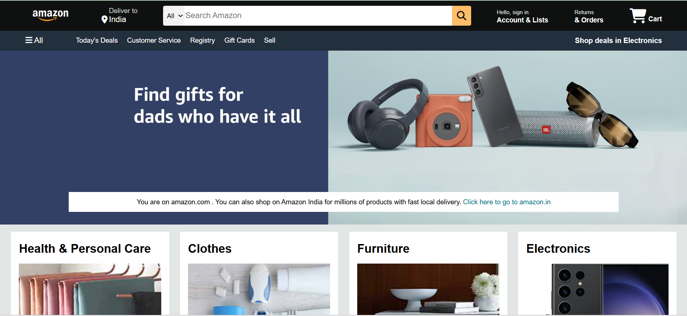
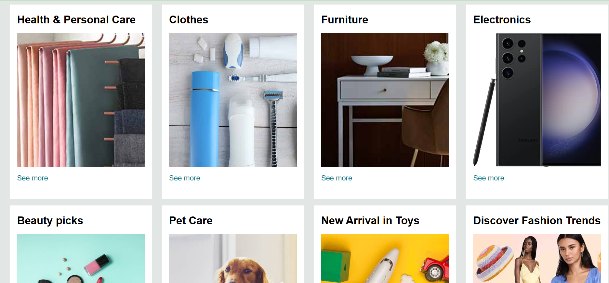
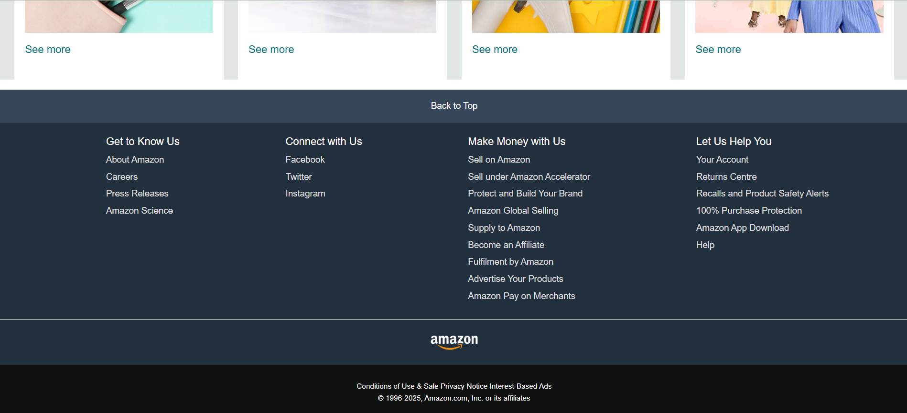

# Amazon Clone

A front-end clone of the Amazon homepage built using HTML and CSS. This project focuses on recreating the layout and visual structure of a real e-commerce website.

## Overview

The project includes key sections such as a navigation bar, search functionality layout, promotional banner, product categories, and footer — closely resembling the original Amazon interface. The goal was to practice layout design and UI structuring.

##  Live Demo
https://khushikumari27x.github.io/amazon-clone/

## Features

- Navigation bar with logo, location, search bar, and cart
- Hero section with promotional banner
- Product category sections (Health, Clothes, Furniture, Electronics, etc.)
- Grid-based layout for product items
- Footer with multiple sections similar to Amazon
- Clean and consistent UI styling

## Technologies Used

- HTML
- CSS

## Project Structure

- `index.html` → Main structure of the webpage  
- `style.css` → Styling and layout  
- `screenshots/` → Contains project preview images  
- Image files → Used for UI elements (logo, product images, etc.)

## Screenshots

### Homepage

### Categories Section

### Footer

## Purpose

This project was created as part of learning front-end development. It helped in understanding layout design, positioning, and styling using HTML and CSS.

## Author

Khushi Kumari
